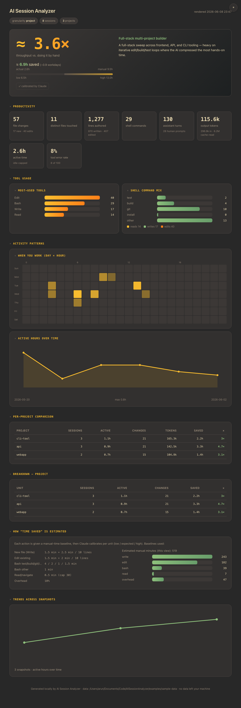
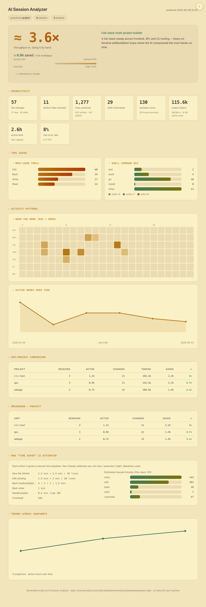

# AI Session Analyzer

A **Claude Code plugin** that analyzes your local session data and generates a
**self-contained HTML report** — productivity, tool usage, activity patterns, per-project
comparison, and a flagship **"time saved → What-X-faster"** estimate.

- **Fully local.** Reads `~/.claude/projects/**/*.jsonl` on your machine; nothing is uploaded.
- **No API key.** Your running Claude Code session *is* the analysis engine.
- **Zero dependencies.** One vanilla Node script + one static HTML file. No `npm install`, no build.
- **Incremental & versioned.** Each run snapshots results; trends build up over time and
  unchanged sessions are reused.
- **Themable.** Gruvbox dark + light — follows your OS theme by default, with an in-report toggle that remembers your choice.

## Demo

A **synthetic** sample report (no real data) lives at [`examples/sample-report.html`](examples/sample-report.html) — open it in a browser, or rebuild with `node examples/build.mjs`.

| Dark | Light |
|------|-------|
|  |  |

## How it works

A deterministic script (`stats.mjs`) does all the exact counting; the Claude session does the
judgment. The skill orchestrates four steps:

```
aggregate  → parse JSONL into per-session "atoms" + write a snapshot   (deterministic)
semantic-plan → list units (overall/project/session) needing analysis   (deterministic)
   ↓ Claude estimates manual-vs-actual time + writes a short narrative   (the LLM part)
apply-semantic → merge those results into the snapshot cache            (deterministic)
render     → roll up to the chosen granularity → self-contained HTML     (deterministic)
```

Granularity is a **roll-up hierarchy** (`overall ⊃ project ⊃ session`). Deterministic metrics
are always stored at the per-session level, so coarser views are free roll-ups. The expensive
LLM layer is **cached per unit** and built up iteratively: ask for finer detail later and only
the missing units are computed; ask coarser and cached results are rolled up. Editing a session
invalidates only the units that contain it.

## Install

**Local (dev / personal):**
```bash
claude --plugin-dir /path/to/ai-tools/ai-session-analyzer   # this plugin's folder
```
Use `/reload-plugins` after edits.

**From the marketplace (once published to GitHub — see below):**
```bash
claude plugin marketplace add arunts/ai-tools   # the repo; reads .claude-plugin/marketplace.json
claude plugin install ai-session-analyzer@arunts-ai-tools
```

> This plugin ships inside the **arunts-ai-tools** marketplace (repo `arunts/ai-tools`), alongside
> other plugins. **Maintaining/publishing yourself?** See the marketplace **[PUBLISHING.md](../PUBLISHING.md)**.
> (End users never need that — they only run the two install commands above.)

## Usage

```
/ai-session-analyzer:analyze-sessions [granularity] [date-range] [project]
```
- `granularity` — `overall` | `project` | `session` (you'll be asked if omitted)
- `date-range` — e.g. `2026-05-01` to scope by start date
- `project` — substring of a project path to filter

The skill asks for granularity, runs the analysis, has the session estimate time-saved, and
writes an HTML report to your report directory, then offers to open it.

## What's measured

| Area | Examples |
|------|----------|
| Productivity | file changes (Write/Edit), distinct files, lines authored/edited, shell commands, turns, tokens, active time (idle-capped) |
| Tool usage | most-used tools, read/write/edit mix, shell command classes (test/build/git/install), tool error rate |
| Activity | day × hour heatmap, active hours over time |
| Per-project | sessions, active time, changes, tokens, time saved per project |
| Time saved | manual-vs-actual estimate with low/expected/high range and a `×` multiplier |

### Time-saved methodology

Each action has a deterministic manual-time **baseline** (authoring, editing, shell, navigation —
see the report's methodology section for the exact rates). The Claude session then **calibrates**
each unit within ~0.6×–1.8× of that baseline using the actual task complexity, producing
`low / expected / high` manual-minute estimates. "Time saved" = manual − actual active time.
The report always shows the assumptions and the range — treat the numbers as a defensible
estimate, not exact truth.

## Configuration

Set on first enable (plugin `userConfig`), all overridable:

| Key | Default |
|-----|---------|
| `session_data_path` | `~/.claude/projects` |
| `snapshot_dir` | `~/.claude/session-analyzer/snapshots` |
| `report_dir` | `~/.claude/session-analyzer/reports` |

## Power-user CLI

`stats.mjs` runs standalone (handy for testing without the skill — note it produces a
heuristic-only time estimate until the skill calibrates it):

```bash
node stats.mjs aggregate --data ~/.claude/projects --out-dir ./snaps
node stats.mjs semantic-plan --snapshot-dir ./snaps --granularity project
node stats.mjs apply-semantic --snapshot-dir ./snaps --input ./semantic.json
node stats.mjs render --snapshot-dir ./snaps --granularity project --template ./report-template.html --out-dir ./reports
```

## Files

```
.claude-plugin/plugin.json       manifest + userConfig
skills/analyze-sessions/SKILL.md the orchestration + LLM instructions
stats.mjs                        the only code — aggregate / semantic-plan / apply-semantic / render (zero deps)
report-template.html             static vanilla report (gruvbox, inline SVG/CSS, offline)
examples/                        synthetic demo (generator, build.mjs, sample-report.html)
docs/                            screenshots
CHANGELOG.md · README.md
```
The marketplace manifest (`.claude-plugin/marketplace.json`), `PUBLISHING.md`, and `LICENSE` live
one level up at the **repo root**, since this plugin is one of several in the `arunts-ai-tools`
marketplace.

## License

MIT
